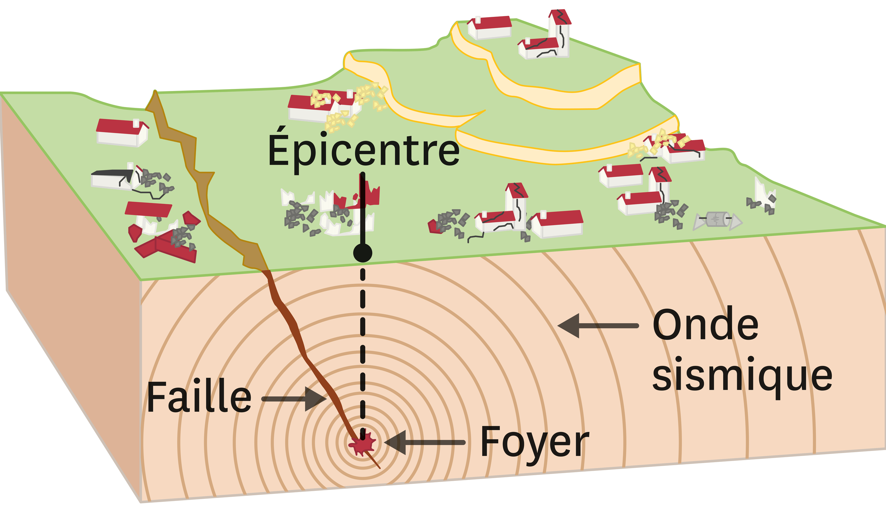

# Projet d'ETL via l'API d'enregistrement des tremblements de terre - Version Luigi

Ce projet est approximativement le même que le projet [earthquake_etl_airflow](https://github.com/Aubin65/earthquake_etl_airflow) mais avec l'utilisation de Luigi comme outil d'orchestration dans le but de tester ses fonctionnalités et les comparer à celles d'Airflow.

La partie visualisation ne sera pas développée dans ce repo car elle n'apporte pas de plus value au comparatif.

## Structure du projet

Le projet sera structuré en trois parties 